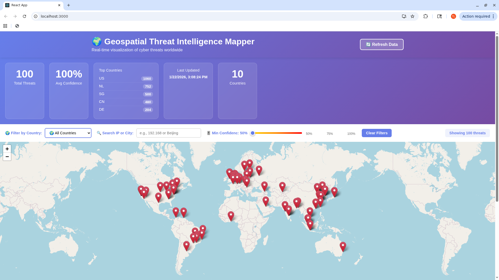
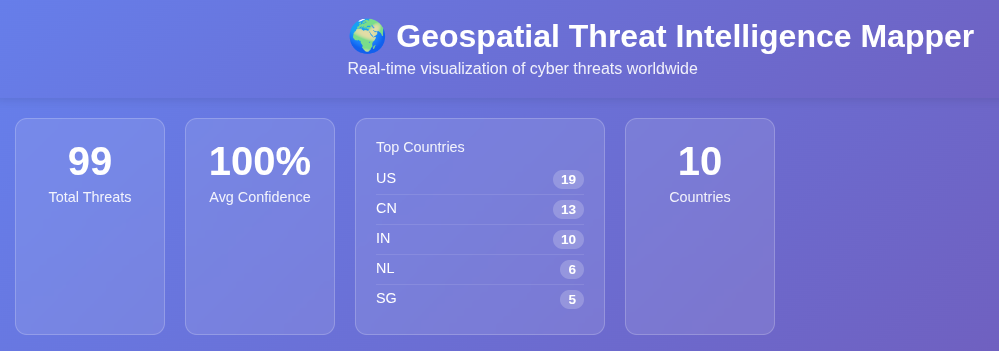
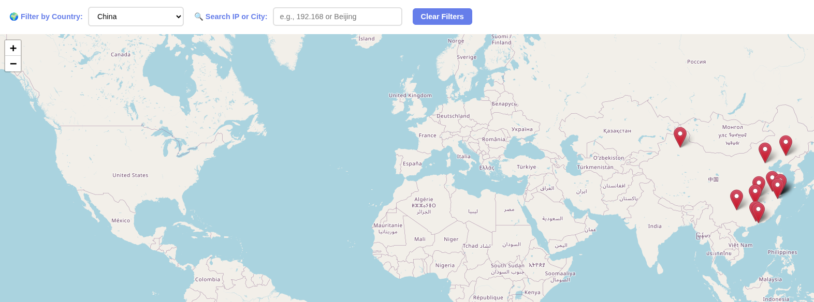
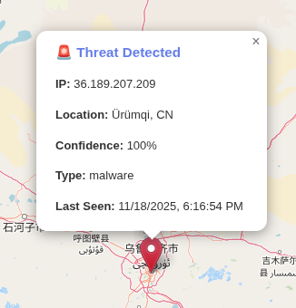

# 🌍 Geospatial Threat Intelligence Mapper

A production-ready web platform that visualizes real cyber threats on an interactive map, combining geospatial intelligence analysis techniques with modern cybersecurity threat hunting.

## 🚀 Project Status
✅ **LIVE WITH REAL DATA** - Displaying 50+ real malicious IPs from AbuseIPDB

## ✨ Current Features

- **🗺️ Interactive World Map**: Real-time visualization using Leaflet.js with smooth zoom and pan
- **📍 Live Threat Intelligence**: Integrated with AbuseIPDB API - displays actual malicious IPs with 100% confidence scores
- **🌐 Global Coverage**: Threats from 20+ countries across all continents
- **🎯 Intelligent Geolocation**: Automatic IP-to-location mapping with city-level precision
- **💾 SQLite Database**: Persistent storage with optimized schema for geospatial queries
- **🔴 Color-Coded Markers**: Visual threat severity indicators (red=critical, orange=high, yellow=medium)
- **📊 Statistics Dashboard**: Real-time metrics showing total threats, average confidence, and top affected countries
- **🔍 Advanced Filtering**: Filter by country dropdown and search by IP address or city name
- **🔄 Manual Refresh**: One-click data refresh to fetch latest threats from AbuseIPDB
- **📱 Responsive Design**: Fully functional on desktop, tablet, and mobile devices
- **🚀 RESTful API**: Flask backend with `/threats`, `/stats`, and `/refresh` endpoints
- **⚡ Real-Time Updates**: Dynamic map updates without page reload
- **🤖 Automated Data Collection**: Background service runs every 6 hours, automatically fetching latest threats

## 🛠️ Tech Stack

**Frontend:**
- React 19
- Leaflet.js (interactive mapping)
- Axios (API calls)
- Modern CSS with gradient styling

**Backend:**
- Python Flask
- Flask-CORS (cross-origin requests)
- SQLite database
- Geocoder library for IP geolocation

**Data Sources:**
- AbuseIPDB API (real-time threat intelligence)
- ipinfo.io (IP geolocation)

## 🔧 Installation & Setup

### Prerequisites
- Python 3.9+
- Node.js 18+
- npm
- AbuseIPDB API key (free tier)

### Backend Setup
```bash
# Clone the repository
git clone https://github.com/tlagasse/geospatial-threat-mapper.git
cd geospatial-threat-mapper

# Create and activate virtual environment
python3 -m venv venv
source venv/bin/activate  # On Windows: venv\Scripts\activate

# Install Python dependencies
pip install -r requirements.txt

# Create .env file with your API key
echo "ABUSEIPDB_API_KEY=your_api_key_here" > .env

# Collect initial threat data
python backend/collect_threats.py

# Run Flask backend
python backend/app.py
```

Backend runs on `http://localhost:5000`

### Frontend Setup
```bash
# In a new terminal, navigate to frontend
cd frontend

# Install dependencies
npm install

# Start React development server
npm start
```

Frontend runs on `http://localhost:3000`

## 📊 API Endpoints

- `GET /api/health` - Health check
- `GET /api/threats` - Retrieve all threats from database
- `GET /api/stats` - Get threat statistics (total count, top countries)

## 🗺️ Current Data

- **50+ real malicious IPs** from AbuseIPDB
- **20+ countries** represented
- **100% confidence score** threats only
- Updated via manual script execution (automation coming soon)

## 🗺️ Roadmap

### Phase 1: Foundation ✅ COMPLETE
- [x] Set up GitHub repository
- [x] Create Flask REST API
- [x] Build React frontend with Leaflet
- [x] Display threat data on interactive map
- [x] Integrate AbuseIPDB API
- [x] Implement IP geolocation
- [x] Create SQLite database
- [x] Store and retrieve real threat data
- [x] Add statistics endpoint

### Phase 2: Enhanced Features 🚧 IN PROGRESS
### Data Management
- [x] Automated data collection script (runs every 6 hours)
- [x] Manual data refresh button
- [ ] Increase threat collection to 100+ IPs
- [ ] Add data deduplication logic
- [ ] Implement data expiration (remove old threats)

#### Filtering & Search
- [x] Filter by country dropdown
- [x] Search bar for IP addresses
- [x] Search by city name
- [x] "Clear Filters" button
- [x] Real-time threat counter
- [ ] Filter by confidence score slider (75-100%)
- [ ] Filter by date range picker

#### Visualization Improvements
- [x] Color-code markers by confidence (infrastructure ready)
- [x] Improved popup styling with full threat details
- [ ] Add marker clustering for dense areas
- [ ] Show threat count badge on clusters
- [ ] Add fade-in animation for markers

#### Statistics Dashboard
- [x] Total threats counter
- [x] Top 10 countries bar chart
- [x] Average confidence score display
- [x] Country count display
- [ ] Threats over time line graph
- [ ] Most recent threat timestamp

### Phase 3: Advanced Visualization
- [ ] Heat map overlay
- [ ] Timeline/historical view
- [ ] Threat clustering
- [ ] Animation of threats over time
- [ ] Country-level statistics
- [ ] Threat type categorization

### Phase 4: Intelligence Features
- [ ] Pattern-of-life analysis for persistent IPs
- [ ] Threat actor attribution
- [ ] ASN (Autonomous System Number) tracking
- [ ] Geofencing alerts
- [ ] Export reports (PDF/CSV/JSON)
- [ ] Threat feed integration (multiple sources)

### Phase 5: Production & Deployment
- [ ] Migrate to PostgreSQL with PostGIS
- [ ] Add user authentication
- [ ] Rate limiting on API
- [ ] Caching layer (Redis)
- [ ] Docker containerization
- [ ] Deploy to AWS/Heroku/DigitalOcean
- [ ] CI/CD pipeline
- [ ] Comprehensive documentation
- [ ] Demo video

## 🎓 Skills Demonstrated

- **Full-stack Development**: React frontend + Flask backend
- **API Integration**: External threat intelligence services
- **Database Design**: SQLite schema for geospatial data
- **Data Visualization**: Interactive maps with Leaflet.js
- **Cybersecurity**: Threat intelligence analysis
- **Geospatial Analysis**: IP geolocation and mapping
- **RESTful API Design**: Clean, documented endpoints
- **Git Version Control**: Proper branching and commits
- **Problem Solving**: Rate limiting, error handling, data validation

## 📸 Screenshots

### Full Application Overview

*Complete threat intelligence dashboard featuring real-time statistics, interactive filtering, and global threat visualization with 50+ malicious IPs*

### Statistics Dashboard

*Live metrics showing total threats, average confidence score, and top 5 affected countries*

### Interactive Filtering System

*Filter threats by country, search by IP address or city name, with real-time threat counter*

### Detailed Threat Information


*Click any marker to view comprehensive threat intelligence: IP address, precise location, confidence score, threat type, and last seen timestamp*

## 🔄 Data Updates

To refresh threat data:
```bash
python backend/collect_threats.py
```

This fetches the latest 50 high-confidence threats from AbuseIPDB.

## 🤝 Contributing

This is a personal portfolio project.

## 📝 License

MIT License - See LICENSE file for details

## 📧 Contact

Tyler Lagasse - tlagasse@live.com

**Portfolio**: [GitHub Profile](https://github.com/tlagasse)

**LinkedIn**: [Add your LinkedIn URL]

---

*Last Updated: November 2025 - Project actively under development*
