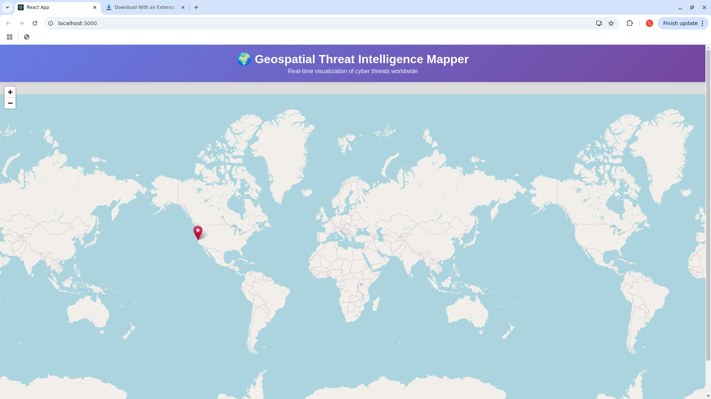

# 🌍 Geospatial Threat Intelligence Mapper

A web-based platform that visualizes cyber threats on an interactive map, combining geospatial intelligence analysis techniques with modern cybersecurity threat hunting.



## 🚀 Project Status
✅ **MVP Complete** - Basic functionality working

## ✨ Features

- **Interactive World Map**: Real-time visualization of cyber threats using Leaflet.js
- **Threat Markers**: Color-coded pins based on threat type (malware, phishing, DDoS)
- **Detailed Popups**: Click markers to view threat details (IP, type, timestamp)
- **Responsive Design**: Works on desktop and mobile devices
- **REST API Backend**: Flask-based API for serving threat data

## 🛠️ Tech Stack

**Frontend:**
- React 19
- Leaflet.js (interactive mapping)
- Axios (API calls)

**Backend:**
- Python Flask
- Flask-CORS (cross-origin requests)

**Planned:**
- PostgreSQL with PostGIS (geospatial database)
- AbuseIPDB API (real-time threat intelligence)
- MaxMind GeoLite2 (IP geolocation)

## 🎯 Background

This project combines my experience as a former military intelligence analyst (FMV/GEOINT) with cybersecurity, applying pattern-of-life analysis and geospatial techniques to threat intelligence.

## 🔧 Installation & Setup

### Prerequisites
- Python 3.9+
- Node.js 18+
- npm

### Backend Setup
```bash
# Clone the repository
git clone https://github.com/tlagasse/geospatial-threat-mapper.git
cd geospatial-threat-mapper

# Create and activate virtual environment
python3 -m venv venv
source venv/bin/activate  # On Windows: venv\Scripts\activate

# Install Python dependencies
pip install -r requirements.txt

# Run Flask backend
python backend/app.py
```

Backend will run on `http://localhost:5000`

### Frontend Setup
```bash
# In a new terminal, navigate to frontend
cd frontend

# Install dependencies
npm install

# Start React development server
npm start
```

Frontend will run on `http://localhost:3000`

## 📊 Current Features Demo

- Sample threat data displayed on map
- Interactive markers with popups
- Zoom and pan functionality
- Professional UI with gradient header

## 🗺️ Roadmap

### Phase 1: Foundation ✅ COMPLETE
- [x] Set up GitHub repository
- [x] Create Flask REST API
- [x] Build React frontend with Leaflet
- [x] Display threat data on interactive map

### Phase 2: Data Integration 🚧 IN PROGRESS
- [ ] Register for AbuseIPDB API
- [ ] Implement IP geolocation with MaxMind
- [ ] Create automated data collection scripts
- [ ] Set up PostgreSQL database
- [ ] Store and retrieve real threat data

### Phase 3: Core Features
- [ ] Add filtering by date/threat type
- [ ] Implement heat map overlay
- [ ] Create timeline visualization
- [ ] Add search functionality
- [ ] Threat actor tracking

### Phase 4: Advanced Features
- [ ] Pattern-of-life analysis for threat actors
- [ ] Real-time alerting
- [ ] Export reports (PDF/CSV)
- [ ] Multi-user support
- [ ] Dashboard with statistics

### Phase 5: Deployment
- [ ] Write comprehensive documentation
- [ ] Create demo video
- [ ] Deploy to cloud platform (AWS/Heroku)
- [ ] Set up CI/CD pipeline

## 🎓 Skills Demonstrated

- Full-stack development (React + Flask)
- RESTful API design
- Geospatial data visualization
- Cybersecurity threat intelligence
- Data analysis and pattern recognition
- Git version control
- Modern web development practices

## 📝 License

MIT License - See LICENSE file for details

## 📧 Contact

Tyler Lagasse - tlagasse@live.com

**Portfolio**: [GitHub Profile](https://github.com/tlagasse)

---

*This project is actively under development. Check back for updates!*
