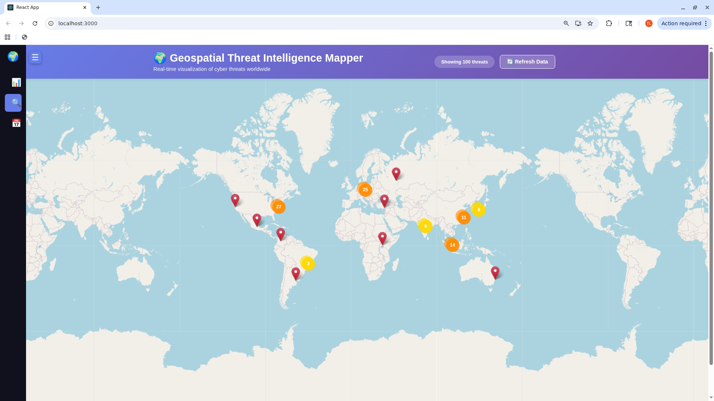
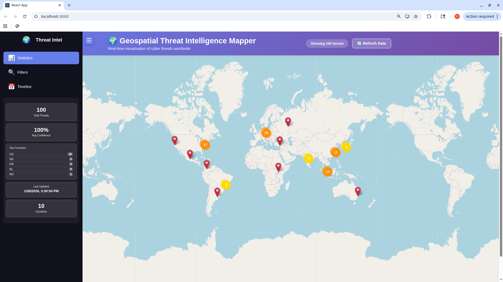
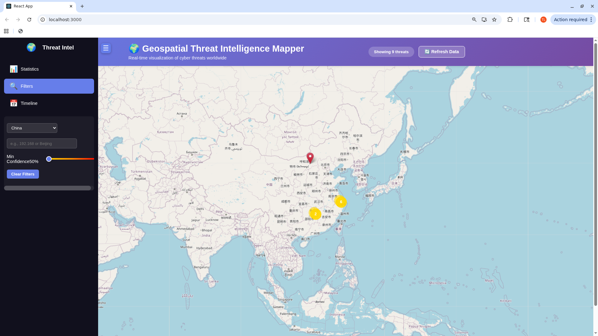
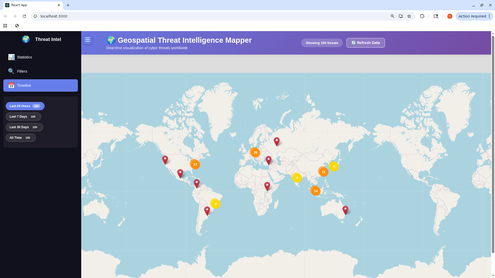
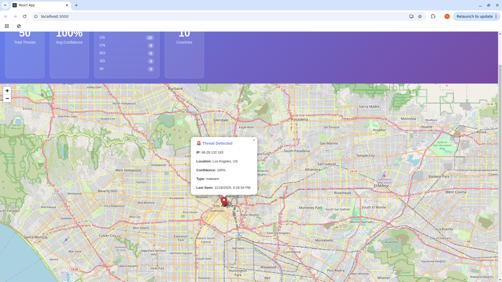

# 🌍 Geospatial Threat Intelligence Mapper

A real-time cybersecurity threat visualization platform that combines geospatial analysis techniques with modern web technologies,

**Live threat data from AbuseIPDB displayed on an interactive world map with advanced filtering, timeline analysis, and intelligent clustering.**

[View Screenshots](#-screenshots) | [Features](#-current-features) | [Tech Stack](#-tech-stack) | [Installation](#-installation)

## 🚀 Project Status
✅ **PRODUCTION-READY** - Automated collection of 100+ real malicious IPs every 6 hours from AbuseIPDB

## ✨ Current Features

### 🗺️ Interactive Visualization
- **Real-time World Map**: Smooth Leaflet.js integration with zoom, pan, and interactive controls
- **Live Threat Intelligence**: Integrated with AbuseIPDB API - displays actual malicious IPs with confidence scores
- **Global Coverage**: Threats from 10+ countries across all continents with city-level precision
- **Color-Coded Severity**: Dynamic markers (🔴 90-100%, 🟠 75-90%, 🟡 50-75%)

### 🎨 Modern User Interface
- **Collapsible Dark Sidebar**: Icon-based navigation with Statistics, Filters, Timeline, and About sections
- **Smooth Animations**: Fade-in effects, cluster transitions, and hover interactions
- **Responsive Design**: Fully functional on desktop, tablet, and mobile devices
- **Professional Footer**: Contact information and technology stack display

### 📊 Analytics & Insights
- **Real-time Statistics Dashboard**: Total threats, average confidence, top 5 countries, global reach
- **Marker Clustering**: Automatic grouping of nearby threats with expandable cluster badges
- **Timeline Analysis**: Filter by Last 24 Hours, 7 Days, 30 Days, or All Time
- **Pattern Recognition**: Vertical stat cards showing threat distribution and trends

### 🔍 Advanced Filtering
- **Country Filter**: Dropdown with full country names and flags
- **IP/City Search**: Real-time search across IP addresses and city names
- **Confidence Slider**: Adjustable threshold (50-100%) with visual gradient
- **Live Threat Counter**: Real-time count displayed in header

### 🛠️ Data Management
- **SQLite Database**: Persistent storage with automatic deduplication
- **30-Day Auto-Expiration**: Automatic cleanup of old threats
- **Performance Monitoring**: Warning banner when database exceeds 200 threats
- **One-Click Cleanup**: Remove old threats with confirmation dialog
- **Manual Refresh**: On-demand data collection from AbuseIPDB
- **Optional Automation**: Systemd service for scheduled collection (every 6 hours)

### 🚀 Technical Excellence
- **RESTful API**: Flask backend with `/threats`, `/stats`, `/refresh`, `/cleanup` endpoints
- **Performance Optimized**: Limited to 200 most recent threats for fast rendering
- **Error Handling**: Graceful degradation with user-friendly error messages
- **Geolocation Intelligence**: Automatic IP-to-location mapping with fallback handling

## 🛠️ Tech Stack

**Frontend:**
- React 19
- Leaflet.js (interactive mapping)
- Axios (API calls)
- Modern CSS with gradient styling and glassmorphism

**Backend:**
- Python Flask
- Flask-CORS (cross-origin requests)
- SQLite database with optimized queries
- Geocoder library for IP geolocation
- Schedule library for automation

**Data Sources:**
- AbuseIPDB API (real-time threat intelligence)
- ipinfo.io (IP geolocation)

## 🔧 Installation & Setup

### Prerequisites
- Python 3.9+
- Node.js 18+
- npm
- AbuseIPDB API key (free tier)

### Backend Setup
```bash
# Clone the repository
git clone https://github.com/tlagasse/geospatial-threat-mapper.git
cd geospatial-threat-mapper

# Create and activate virtual environment
python3 -m venv venv
source venv/bin/activate  # On Windows: venv\Scripts\activate

# Install Python dependencies
pip install -r requirements.txt

# Create .env file with your API key
echo "ABUSEIPDB_API_KEY=your_api_key_here" > .env

# Collect initial threat data
python backend/collect_threats.py

# Run Flask backend
python backend/app.py
```

Backend runs on `http://localhost:5000`

### Frontend Setup
```bash
# In a new terminal, navigate to frontend
cd frontend

# Install dependencies
npm install

# Start React development server
npm start
```

Frontend runs on `http://localhost:3000`

### Optional: Set Up Automated Data Collection

On Linux systems, enable the systemd service for automatic updates every 6 hours:
```bash
sudo cp threat-collector.service /etc/systemd/system/
sudo systemctl daemon-reload
sudo systemctl enable threat-collector.service
sudo systemctl start threat-collector.service
```

## 📊 API Endpoints

- `GET /api/health` - Health check
- `GET /api/threats` - Retrieve 100 most recent threats from database
- `GET /api/stats` - Get threat statistics (total count, top countries, last update time)
- `POST /api/refresh` - Manually trigger data collection from AbuseIPDB

## 📸 Screenshots

### Full Map View - Global Threat Visualization

*Interactive world map showing real-time cyber threats with marker clustering. Clean, minimalist interface with collapsible sidebar.*

### Statistics Dashboard

*Compact vertical statistics showing total threats, average confidence score, top 5 affected countries, and total countries represented.*

### Advanced Filtering

*Intuitive filtering by country, IP/city search, and confidence score slider with real-time threat counter.*

### Timeline-Based Analysis

*Historical threat filtering with time range buttons showing threat counts for different periods (24 hours, 7 days, 30 days, all time).*

### Detailed Threat Intelligence

*Click any threat marker to view comprehensive information: IP address, precise location, confidence score, threat type, and last seen timestamp.*

## 🗺️ Development Roadmap

### Phase 1: Foundation ✅ COMPLETE
- [x] Set up GitHub repository
- [x] Create Flask REST API
- [x] Build React frontend with Leaflet
- [x] Display threat data on interactive map
- [x] Integrate AbuseIPDB API
- [x] Implement IP geolocation
- [x] Create SQLite database
- [x] Store and retrieve real threat data
- [x] Add statistics endpoint

### Phase 2: Enhanced Features ✅ COMPLETE
- [x] Automated data collection (runs every 6 hours)
- [x] Manual data refresh button
- [x] Increase threat collection to 100 IPs
- [x] Data deduplication logic
- [x] Data expiration (30-day cleanup)
- [x] Filter by country dropdown
- [x] IP/city search functionality
- [x] Clear filters button
- [x] Real-time threat counter
- [x] Confidence score slider filter
- [x] Color-coded markers by severity
- [x] Statistics dashboard with live metrics
- [x] Last updated timestamp display

### Phase 3: Advanced Visualization ✅ COMPLETE
- [x] Marker clustering for dense areas
- [x] Cluster count badges with color coding
- [x] Fade-in animations for marker
- [x] Smooth cluster animations on hover
- [x] Timeline/historical view
- [x] Collapsible sidebar navigation
- [x] Performance monitoring and cleanup tools
- [x] Footer and About section


### Phase 4: Intelligence Features
- [ ] Pattern-of-life analysis for persistent IPs
- [ ] Threat actor attribution
- [ ] ASN (Autonomous System Number) tracking
- [ ] Geofencing alerts
- [ ] Export reports (PDF/CSV/JSON)
- [ ] Multi-source threat feed integration

### Phase 5: Production & Deployment
- [ ] Migrate to PostgreSQL with PostGIS
- [ ] Add user authentication
- [ ] Rate limiting on API
- [ ] Caching layer (Redis)
- [ ] Docker containerization
- [ ] Deploy to cloud (AWS/DigitalOcean)
- [ ] CI/CD pipeline with GitHub Actions
- [ ] Comprehensive API documentation
- [ ] Demo video

## 🎓 Skills Demonstrated

- **Full-stack Development**: React frontend + Flask backend
- **API Integration**: External threat intelligence services
- **Database Design**: SQLite schema for geospatial data with automated cleanup
- **Data Visualization**: Interactive maps with Leaflet.js
- **Cybersecurity**: Threat intelligence analysis and data collection
- **Geospatial Analysis**: IP geolocation and mapping techniques from GEOINT background
- **System Administration**: Systemd service configuration and automation
- **RESTful API Design**: Clean, documented endpoints
- **Performance Optimization**: Query optimization and data limiting
- **Git Version Control**: Proper commits and documentation

## 🔄 Data Updates

The automated service collects fresh threat data every 6 hours. You can also manually refresh:

**Via UI**: Click the "Refresh Data" button in the header

**Via CLI**:
```bash
python backend/collect_threats.py
```

**Service management**:
```bash
# Check status
sudo systemctl status threat-collector.service

# View logs
sudo journalctl -u threat-collector.service -f

# Restart service
sudo systemctl restart threat-collector.service
```

## 🤝 Contributing

This is a personal portfolio project, but suggestions and feedback are welcome!

## 📝 License

MIT License - See LICENSE file for details

## 📧 Contact

Tyler Lagasse - tlagasse@live.com

**GitHub**: [github.com/tlagasse](https://github.com/tlagasse)

---

*Last Updated: January 2026 - Production-ready with automated threat collection*
